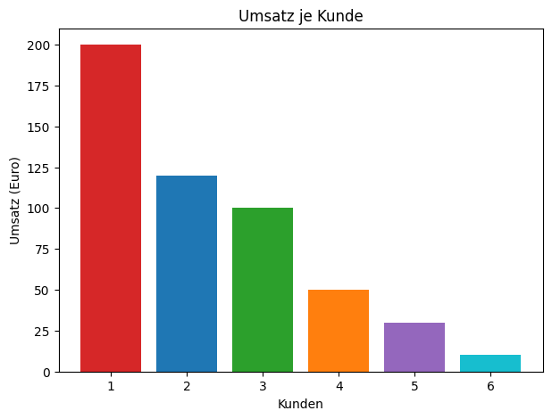
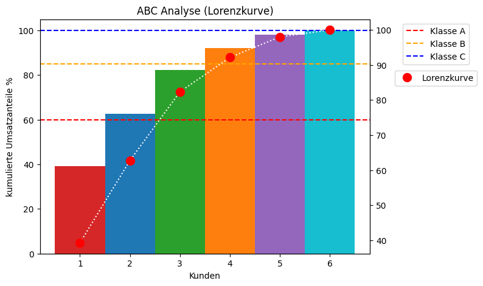

```python
import numpy as np
import pandas as pd
import matplotlib.pyplot as plt 
```


```python
df = pd.DataFrame ({'Anzahl (xi)': [20,12,10,5,3,1], 'Umsatz (hi)': [200,120,100,50,30,10]})
```


```python
kunde = np.arange(1, len(df) + 1)
```


```python
fig, ax = plt.subplots()
fig.set_figwidth(7)
fig.set_figheight(5)
umsatz = df['Umsatz (hi)']
bar_colors = ['tab:red', 'tab:blue', 'tab:green', 'tab:orange','tab:purple', 'tab:cyan']
ax.bar(kunde, umsatz, color=bar_colors)
ax.set_ylabel('Umsatz (Euro)')
ax.set_xlabel('Kunden')
ax.set_title('Umsatz je Kunde')
plt.show()
```


    

    


```python
df['Relative Häufigkeit (rel_hi)'] = df['Umsatz (hi)'] / df['Umsatz (hi)'].sum()
df['Relative Häufigkeit (rel_Hi)'] = df['Relative Häufigkeit (rel_hi)'].cumsum() * 100
df['Relative Häufigkeit (rel_xi)'] = df['Anzahl (xi)'] / df['Anzahl (xi)'].sum()
df['Relative Häufigkeit (rel_Xi)'] = df['Relative Häufigkeit (rel_xi)'].cumsum() * 100
df
```


<div>

<table border="1" class="dataframe">
  <thead>
    <tr style="text-align: right;">
      <th></th>
      <th>Anzahl (xi)</th>
      <th>Umsatz (hi)</th>
      <th>Relative Häufigkeit (rel_hi)</th>
      <th>Relative Häufigkeit (rel_Hi)</th>
      <th>Relative Häufigkeit (rel_xi)</th>
      <th>Relative Häufigkeit (rel_Xi)</th>
    </tr>
  </thead>
  <tbody>
    <tr>
      <th>0</th>
      <td>20</td>
      <td>200</td>
      <td>0.392157</td>
      <td>39.215686</td>
      <td>0.392157</td>
      <td>39.215686</td>
    </tr>
    <tr>
      <th>1</th>
      <td>12</td>
      <td>120</td>
      <td>0.235294</td>
      <td>62.745098</td>
      <td>0.235294</td>
      <td>62.745098</td>
    </tr>
    <tr>
      <th>2</th>
      <td>10</td>
      <td>100</td>
      <td>0.196078</td>
      <td>82.352941</td>
      <td>0.196078</td>
      <td>82.352941</td>
    </tr>
    <tr>
      <th>3</th>
      <td>5</td>
      <td>50</td>
      <td>0.098039</td>
      <td>92.156863</td>
      <td>0.098039</td>
      <td>92.156863</td>
    </tr>
    <tr>
      <th>4</th>
      <td>3</td>
      <td>30</td>
      <td>0.058824</td>
      <td>98.039216</td>
      <td>0.058824</td>
      <td>98.039216</td>
    </tr>
    <tr>
      <th>5</th>
      <td>1</td>
      <td>10</td>
      <td>0.019608</td>
      <td>100.000000</td>
      <td>0.019608</td>
      <td>100.000000</td>
    </tr>
  </tbody>
</table>
</div>


```python
fig, ax1 = plt.subplots()
fig.set_figwidth(7)
fig.set_figheight(5)
umsatz = df['Relative Häufigkeit (rel_Hi)']
bar_colors = ['tab:red', 'tab:blue', 'tab:green', 'tab:orange','tab:purple', 'tab:cyan']
ax1.bar(kunde, umsatz, color=bar_colors, width=1.0) 
plt.axhline(y = 60, color = 'red', linestyle = 'dashed',label = "Klasse A") 
plt.axhline(y = 85, color = 'orange', linestyle = 'dashed',label = "Klasse B") 
plt.axhline(y = 100, color = 'blue', linestyle = 'dashed',label = "Klasse C") 
ax1.legend(bbox_to_anchor = (1.2, 1), loc = 'upper center') 
ax1.set_ylabel('kumulierte Umsatzanteile %')
ax1.set_xlabel('Kunden')
ax1.set_title('ABC Analyse (Lorenzkurve)')
ax2 = ax1.twinx()
ax2.plot(kunde,df['Relative Häufigkeit (rel_Hi)'], linestyle='dotted', marker='o', color='white', label='Lorenzkurve', markersize=10, mec="r",mfc="r")
ax2.legend(bbox_to_anchor = (1.2, 0.8), loc = 'upper center') 
plt.show()
```


    

    


```python
conditions = [
    (df['Relative Häufigkeit (rel_Hi)'] > 85),
    (df['Relative Häufigkeit (rel_Hi)'] >= 60) & (df['Relative Häufigkeit (rel_Hi)'] <= 85),
    (df['Relative Häufigkeit (rel_Hi)'] < 60)
    ]
values = ['A','B','C']
df['Kundenklasse'] = np.select(conditions, values)
df = df.sort_values(['Umsatz (hi)'])
df
```


<div>

<table border="1" class="dataframe">
  <thead>
    <tr style="text-align: right;">
      <th></th>
      <th>Anzahl (xi)</th>
      <th>Umsatz (hi)</th>
      <th>Relative Häufigkeit (rel_hi)</th>
      <th>Relative Häufigkeit (rel_Hi)</th>
      <th>Relative Häufigkeit (rel_xi)</th>
      <th>Relative Häufigkeit (rel_Xi)</th>
      <th>Kundenklasse</th>
    </tr>
  </thead>
  <tbody>
    <tr>
      <th>5</th>
      <td>1</td>
      <td>10</td>
      <td>0.019608</td>
      <td>100.000000</td>
      <td>0.019608</td>
      <td>100.000000</td>
      <td>A</td>
    </tr>
    <tr>
      <th>4</th>
      <td>3</td>
      <td>30</td>
      <td>0.058824</td>
      <td>98.039216</td>
      <td>0.058824</td>
      <td>98.039216</td>
      <td>A</td>
    </tr>
    <tr>
      <th>3</th>
      <td>5</td>
      <td>50</td>
      <td>0.098039</td>
      <td>92.156863</td>
      <td>0.098039</td>
      <td>92.156863</td>
      <td>A</td>
    </tr>
    <tr>
      <th>2</th>
      <td>10</td>
      <td>100</td>
      <td>0.196078</td>
      <td>82.352941</td>
      <td>0.196078</td>
      <td>82.352941</td>
      <td>B</td>
    </tr>
    <tr>
      <th>1</th>
      <td>12</td>
      <td>120</td>
      <td>0.235294</td>
      <td>62.745098</td>
      <td>0.235294</td>
      <td>62.745098</td>
      <td>B</td>
    </tr>
    <tr>
      <th>0</th>
      <td>20</td>
      <td>200</td>
      <td>0.392157</td>
      <td>39.215686</td>
      <td>0.392157</td>
      <td>39.215686</td>
      <td>C</td>
    </tr>
  </tbody>
</table>
</div>


